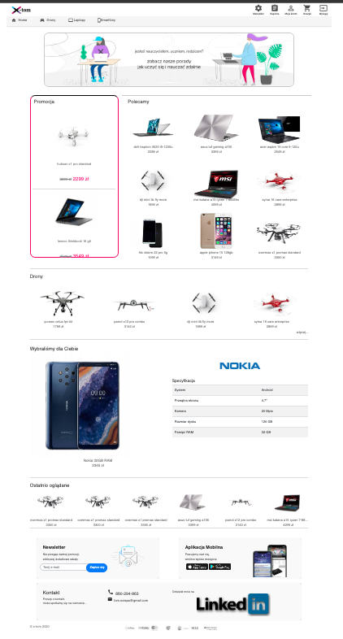

# 🛒 X-Tom — E-commerce Web Application (Java + Angular)

**X-Tom** is a full-featured e-commerce application built using a microservices architecture. It allows users to browse products, manage a cart, place orders, and handle their account. An admin panel is also included, enabling management of products and user roles.

> 🔗 Live Demo (frontend): [https://x-tom-b8232faaabb4.herokuapp.com](https://x-tom-b8232faaabb4.herokuapp.com)

---

## 🧩 Features

### 👤 User:
- Registration and login (email activation required)
- Product browsing with filtering and categories
- Shopping cart and order placement
- Order history
- Password reset via email

### 🛠️ Administrator:
- Add, edit, and delete products
- Manage users and assign roles

---

## 🧪 Technologies

**Backend:**
- Java
- Spring Boot
- Spring Security + JWT
- Hibernate / JPA
- MySQL
- Docker
- Maven
- REST API

**Frontend:**
- Angular
- TypeScript
- RxJS
- Bootstrap / SCSS

**DevOps / Tools:**
- AWS (EC2 / RDS)
- Docker
- Heroku (frontend)
- Postman (API testing)

---

## 🧱 Architecture

The project consists of two main modules:
- **AuthService** – handles authentication, login, registration, and JWT token management
- **ProductService** – responsible for product, order, and admin functionalities

Communication between services is done via RESTful APIs.

---
### 📸 Main Screen




## 🖥️ Running the project locally

### 1. Clone the repository

```bash
git clone https://github.com/TomaszOciepa/x-tom.git
cd x-tom
```

### 2. Set up the database

Create a MySQL (or PostgreSQL) database named `shop`.

Example for **MySQL**:

```sql with Docker
docker run --platform linux/x86_64 -p 3306:3306 --name mysql-x-tom -e MYSQL_ROOT_PASSWORD=pass123 -e MYSQL_DATABASE=shop -d mysql:5.7 --character-set-server=utf8mb4 --collation-server=utf8mb4_unicode_ci

```

> 🔐 Make sure to configure your database username and password in the appropriate `application.properties` files:
>
> - `auth-service/src/main/resources/application.properties`
> - `product-service/src/main/resources/application.properties`

```properties
spring.datasource.url=jdbc:mysql://localhost:3306/shop
spring.datasource.username=your_username
spring.datasource.password=your_password
```

### 3. Run the backend services

You can run the services using your IDE or via Maven:

```bash
# In auth-service directory
cd auth-service
mvn spring-boot:run

# In a new terminal, run product-service
cd ../product-service
mvn spring-boot:run
```

Or run them using Docker (if Dockerfiles are configured).

### 4. Run the Angular frontend

```bash
cd frontend
npm install
ng serve
```

> ⚠️ **Note:** This is a legacy project built with Angular CLI version 8.3.21.  
> If you're using Node.js version 17 or higher, run the app with the following command to avoid cryptographic errors:
>
> ```bash
> NODE_OPTIONS=--openssl-legacy-provider ng serve
> ```


Then open your browser at: [http://localhost:4200](http://localhost:4200)
